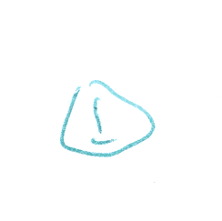

# RIIV

## Project inputs

The database is constituted of two separated directories : 
- PNG images containing small hand-drawn symbols. One symbol per image;
- txt files with an identical name, a label describing to which model the image is associated. 

Here is an example of an image and its associated txt file : 


```
# Projet TIV  Grp:3
label accident
form 00004
scripter 000
page 04
row 7
column 2
size small
```

## Feature extraction and outputs

The feature extraction phase shall use OpenCV to extract characteristics from all images. These characteristics can be of various types, being as simple as a density of black pixels (after a binarization) or as complex as SIFT. 

These features will be presented in a ARFF file format representing the whole processed image base. An ARFF file looks like that : 

```
@RELATION name

@ATTRIBUTE first_characteristic
```


